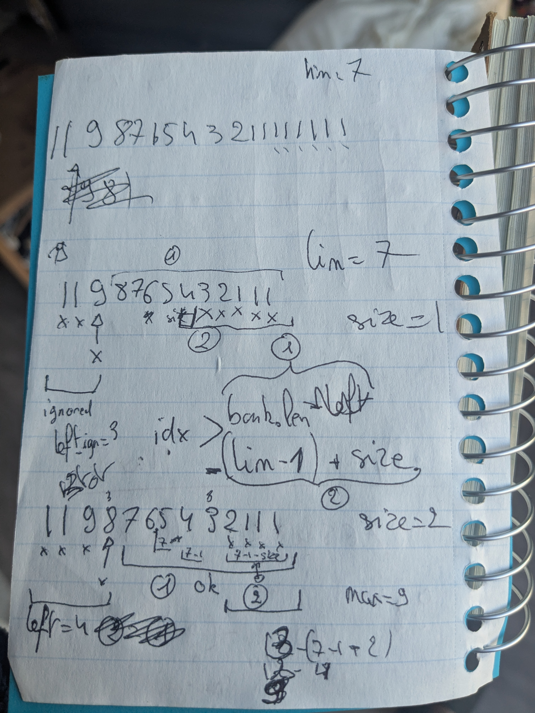

# Advent of Code 2025

My take at this year event! Mandatory readme, used as a journal.

## Day 2

Little bit disappointed at the speed of my solution for part two, there might be a way to get better speed...

## Day 3

I tried to anticipate part 2... that was a bad idea, I just wasted my time. Lesson learned.

Here is a small peak at my ~~brain~~ notes for part 2:

While this look like gargabe, it was actually super helpful to put my "thoughts" on paper so I could nail down the proper filters in [`highest12`](day03/src/main.rs#L47-48).

It feels nice to have a very fast solution, as opposed to yesterday hehehe.